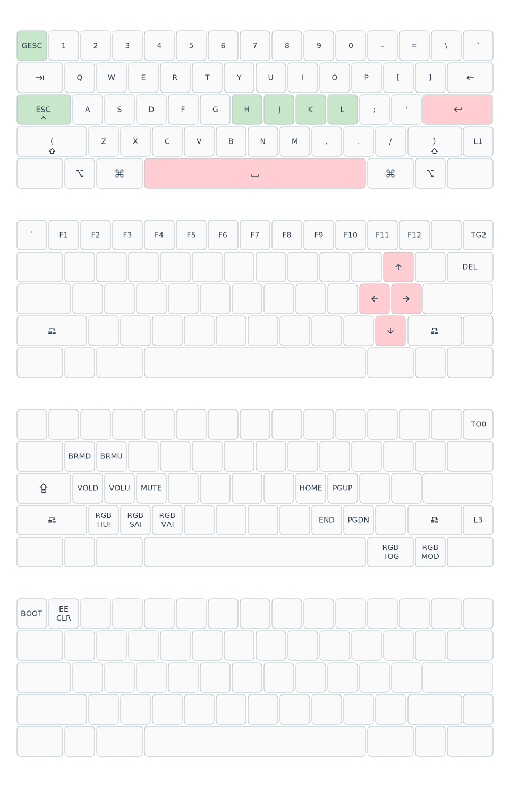

# QMK custom keymaps

[](https://github.com/haunt98/qmk_keymaps/actions/workflows/go.yml)
[](https://github.com/haunt98/qmk_keymaps/actions/workflows/qmk.yml)

## [dztech/dz60rgb_wkl](https://github.com/qmk/qmk_firmware/tree/master/keyboards/dztech/dz60rgb_wkl)

> V2.1: ATmega32U4 (AVR), takes .bin files Started shipping in June 2021 as a
> slightly modified version of v2.

### Stock

Stock firmware is `dztech_dz60rgb_wkl/stock/new dztech_dz60rgb_wkl_v3_via.bin`.
Can be flashed with QMK Toolbox.

Links:

- [DZ60RGB-WKL Hot-Swap PCB](https://kbdfans.com/products/dz60rgb-wkl-hot-swap-pcb)
- [USB Drive Flash Manual (New Flash Manual)](https://docs.google.com/document/d/111qx6Qec4JqtIhWaZlMND-VuRnFtn9a-gJaHN8fsL7M/edit?usp=sharing)

### Compile

```sh
make dztech_dz60rgb_wkl
# Output is dztech_dz60rgb_wkl_v2_1_haunt98.bin
```

### Keymap

#### qmkasciigen

[asciiart](dztech_dz60rgb_wkl/asciiart/haunt98.txt)

#### caksoylar/keymap-drawer



## Install

Locate firmware file after compile successfully or download from
[QMK action workflow](https://github.com/haunt98/qmk_keymaps/actions/workflows/qmk.yml)

Put keyboard into bootloader mode in 2 ways:

- Press `QK_BOOT`.
- Unplug cable, then hold `ESC` and plug cable.

Use [QMK Toolbox](https://github.com/qmk/qmk_toolbox) to flash.

## Maintain

Step by steps:

1. Make changes to keymaps: `*.c`, `*.h`, `*.mk`
2. Push changes to GitHub
3. Download firmware + keymaps JSON
4. Replace repo keymaps JSON
5. Visualize keymap: `make draw`

You don't need to install [QMK CLI](https://github.com/qmk/qmk_cli) but still
need QMK Toolbox.

## Features

Basic

- [Introduction](https://github.com/qmk/qmk_firmware/blob/master/docs/getting_started_introduction.md)
- [Keymap FAQ](https://github.com/qmk/qmk_firmware/blob/master/docs/faq_keymap.md)
- [Keymap Overview](https://github.com/qmk/qmk_firmware/blob/master/docs/keymap.md)
- [Keycodes Overview](https://github.com/qmk/qmk_firmware/blob/master/docs/keycodes.md)
- [Modifier Keys](https://github.com/qmk/qmk_firmware/blob/master/docs/feature_advanced_keycodes.md)
- [Quantum Keycodes](https://github.com/qmk/qmk_firmware/blob/master/docs/quantum_keycodes.md)
- [Layers](https://github.com/qmk/qmk_firmware/blob/master/docs/feature_layers.md)

More than Basic

- [Debugging FAQ](https://github.com/qmk/qmk_firmware/blob/master/docs/faq_debug.md)
- [How to Customize Your Keyboard's Behavior](https://github.com/qmk/qmk_firmware/blob/master/docs/custom_quantum_functions.md)
- [List of Useful Core Functions To Make Your Keyboard Better](https://github.com/qmk/qmk_firmware/blob/master/docs/ref_functions.md)
- [Userspace: Sharing Code Between Keymaps](https://github.com/qmk/qmk_firmware/blob/master/docs/feature_userspace.md)

Do

- [Bootmagic Lite](https://github.com/qmk/qmk_firmware/blob/master/docs/feature_bootmagic.md)
- [Contact bounce / contact chatter](https://github.com/qmk/qmk_firmware/blob/master/docs/feature_debounce_type.md)
- [Grave Escape](https://github.com/qmk/qmk_firmware/blob/master/docs/feature_grave_esc.md)
- [Mod-Tap](https://github.com/qmk/qmk_firmware/blob/master/docs/mod_tap.md)
- [Tap-Hold Configuration Options](https://github.com/qmk/qmk_firmware/blob/master/docs/tap_hold.md)
- [Tap Dance: A Single Key Can Do 3, 5, or 100 Different Things](https://github.com/qmk/qmk_firmware/blob/master/docs/feature_tap_dance.md)
- [Space Cadet: The Future, Built In](https://github.com/qmk/qmk_firmware/blob/master/docs/feature_space_cadet.md)

Don't

- [Magic Keycodes](https://github.com/qmk/qmk_firmware/blob/master/docs/keycodes_magic.md)
- [Command](https://github.com/qmk/qmk_firmware/blob/master/docs/feature_command.md)
- [Mouse keys](https://github.com/qmk/qmk_firmware/blob/master/docs/feature_mouse_keys.md)
- [One Shot Keys](https://github.com/qmk/qmk_firmware/blob/master/docs/one_shot_keys.md)
- [RGB Matrix Lighting](https://docs.qmk.fm/#/feature_rgb_matrix)
- [Auto Shift: Why Do We Need a Shift Key?](https://github.com/qmk/qmk_firmware/blob/master/docs/feature_auto_shift.md):
  Conflict with space cadet when using vim `:w` -> `:)w`

Build/Optimize

- [Configuring QMK](https://github.com/qmk/qmk_firmware/blob/master/docs/config_options.md)
- [Squeezing the most out of AVR](https://github.com/qmk/qmk_firmware/blob/master/docs/squeezing_avr.md)
- [Reducing firmware size](https://get.vial.today/docs/firmware-size.html)
- [Configuring QMK](https://www.caniusevia.com/docs/configuring_qmk)

Interesting

- [Measure and reduce keyboard input latency with QMK on the Kinesis Advantage (2021)](https://michael.stapelberg.ch/posts/2021-05-08-keyboard-input-latency-qmk-kinesis/)
- [A guide to home row mods](https://precondition.github.io/home-row-mods)
- [A Modern Space Cadet](https://stevelosh.com/blog/2012/10/a-modern-space-cadet/)
- [QMK debounce masterclass](https://kbd.news/QMK-debounce-masterclass-1435.html)
- [The SpaceFN layout: trying to end keyboard inflation](https://geekhack.org/index.php?topic=51069.0)
- [Yet another keyboard post, or, introducing ErgoNICE](https://val.packett.cool/blog/ergonice/)
- [Keyboard Matrix Scanning and Debouncing](https://summivox.wordpress.com/2016/06/03/keyboard-matrix-scanning-and-debouncing/)
- [QMK USB to USB Keyboard Protocol Converter](https://yaowei.dev/posts/usb-to-usb-converter/)
- [Programming On 34 Keys](https://peppe.rs/posts/programming_on_34_keys/)
- [Miryoku](https://github.com/manna-harbour/miryoku)
- [Pascal Getreuer's QMK keymap](https://github.com/getreuer/qmk-keymap)
- [Sweep](https://github.com/davidphilipbarr/Sweep)
- [Toward a more useful keyboard](https://github.com/jasonrudolph/keyboard)
- [manna-harbour/xmk](https://github.com/manna-harbour/xmk)

Tools:

- [rvaiya/keyd](https://github.com/rvaiya/keyd)
- [kmonad/kmonad](https://github.com/kmonad/kmonad)
- [bloznelis/kbt](https://github.com/bloznelis/kbt)

## qmkasciigen

Install:

```sh
go install github.com/haunt98/qmk_keymaps/cmd/qmkasciigen@latest
```

Usage:

```sh
# Generate from QMK repo
# Keymap must be JSON (exist keymap.json)
qmkasciigen -qmk-keyboard ymdk/id75 -qmk-keymap via -out ascii.txt

# Generate from local keymap.json
qmkasciigen -qmk-keyboard dztech/dz60rgb_wkl/v2_1 -qmk-keymap-file dztech_dz60rgb_wkl/keymaps_json/haunt98/keymap.json -out ascii.txt
```

Thanks:

- [yskoht/keymapviz](https://github.com/yskoht/keymapviz)
- [caksoylar/keymap-drawer](https://github.com/caksoylar/keymap-drawer)

## TODO

- [x] How to flash
- [x] Add stock firmware/docs
- [x] Add qmk lint
- [x] Visualize
- [x] qmkasciigen
  - [x] Use flag
  - [x] Add docs
  - [x] Get data directly from qmk
  - [ ] Split transform keycodes to raw binding/transform (same as
        keymap-drawer)
