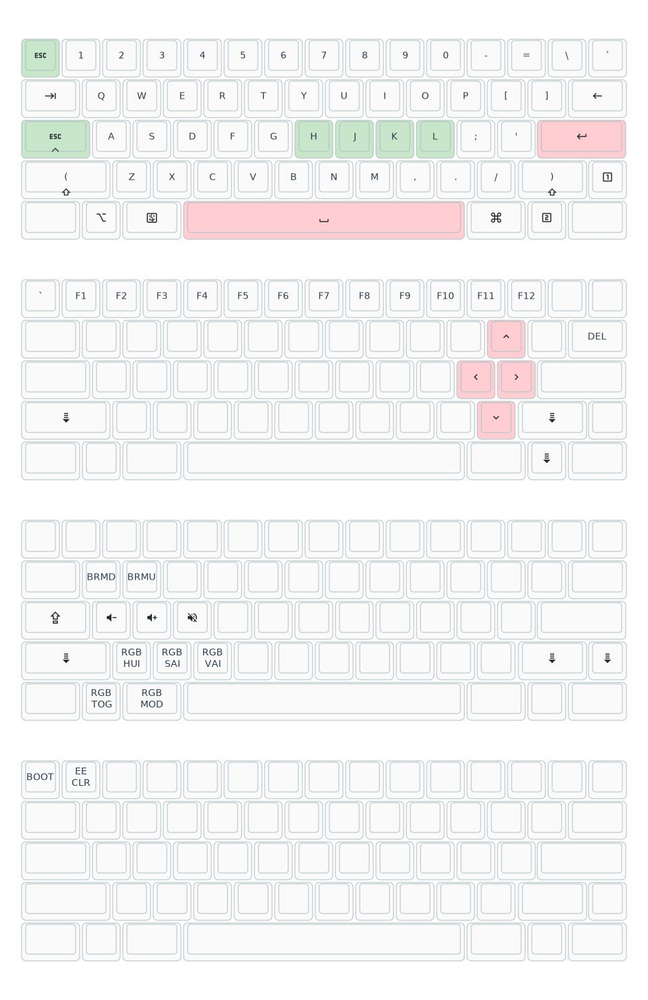
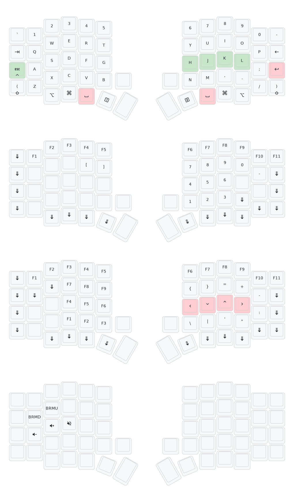

# QMK custom keymaps

[](https://github.com/haunt98/qmk_keymaps/actions/workflows/go.yml)
[](https://github.com/haunt98/qmk_keymaps/actions/workflows/qmk.yml)
[](https://github.com/haunt98/qmk_keymaps/tags)

## [dztech/dz60rgb_wkl](https://github.com/qmk/qmk_firmware/tree/master/keyboards/dztech/dz60rgb_wkl)

> V2.1: ATmega32U4 (AVR), takes .bin files Started shipping in June 2021 as a
> slightly modified version of v2.

### Stock

Stock firmware is `dztech_dz60rgb_wkl/stock/new dztech_dz60rgb_wkl_v3_via.bin`.
Can be flashed with QMK Toolbox.

Links:

- [DZ60RGB-WKL Hot-Swap PCB](https://kbdfans.com/products/dz60rgb-wkl-hot-swap-pcb)
- [USB Drive Flash Manual (New Flash Manual)](https://docs.google.com/document/d/111qx6Qec4JqtIhWaZlMND-VuRnFtn9a-gJaHN8fsL7M/edit?usp=sharing)
- [moyi4681/firmware](https://github.com/moyi4681/firmware)

### Keymap



## [sofle/rev1](https://github.com/qmk/qmk_firmware/tree/master/keyboards/sofle/rev1)

See [Official/Original](https://josefadamcik.github.io/SofleKeyboard/)

> 128x32 OLED display module

> Don’t connect or disconnect the TRRS cable when the keyboard is powered. It
> may short out. Always disconnect the USB cable first.

Bought from
[ergomech.store](https://ergomech.store/shop/sofle-v2-sandwich-style-12)

> Powered by the powerful RP2040 MCU, allowing users to use more macros and
> features from QMK. However, cannot be used with usb-c to usb-c cable

There is a button below the board, press twice to enter boot mode.

### Flash notes

> - Make sure halves are not connected together with TRRS cable.
> - Connect one half to USB, flash the firmware. Use the reset button to reset
>   the keyboard when you are asked to in console.
> - Connect the second half and flash it in the same way as the previous one.
> - Disconnect the USB cable. Connect both halves together with TRRS cable.
> - Connect USB cable to the left side.

There is a button below OLED/above encoder. Press 2 times to reset.

### Keymap



## Flash

Enter bootloader in many ways:

- Bootmagic reset: Unplug cable, then hold key in row 0 col 0 and plug cable.
- Keycode: Press `QK_BOOT`.
- Physical reset button: Read manual of your PCB, likely will have a reset
  button

If use [QMK Toolbox](https://github.com/qmk/qmk_toolbox), locate firmware file
after compile successfully or download from
[QMK action workflow](https://github.com/haunt98/qmk_keymaps/actions/workflows/qmk.yml)

## Maintain

Step by step:

- Make changes to keymaps: `*.c`, `*.h`, `*.mk`
  - Format `keymap.c` with `column -t`
- Apply changes to keymaps JSON: `make qmk_all`
- Visualize keymap: `make draw`

## Features

Basic:

- [Introduction](https://github.com/qmk/qmk_firmware/blob/master/docs/getting_started_introduction.md)
- [Keymap FAQ](https://github.com/qmk/qmk_firmware/blob/master/docs/faq_keymap.md)
- [Keymap Overview](https://github.com/qmk/qmk_firmware/blob/master/docs/keymap.md)
- [Keycodes Overview](https://github.com/qmk/qmk_firmware/blob/master/docs/keycodes.md)
- [Modifier Keys](https://github.com/qmk/qmk_firmware/blob/master/docs/feature_advanced_keycodes.md)
- [Quantum Keycodes](https://github.com/qmk/qmk_firmware/blob/master/docs/quantum_keycodes.md)
- [Layers](https://github.com/qmk/qmk_firmware/blob/master/docs/feature_layers.md)

More advance:

- [Debugging FAQ](https://github.com/qmk/qmk_firmware/blob/master/docs/faq_debug.md)
- [How to Customize Your Keyboard's Behavior](https://github.com/qmk/qmk_firmware/blob/master/docs/custom_quantum_functions.md)
- [List of Useful Core Functions To Make Your Keyboard Better](https://github.com/qmk/qmk_firmware/blob/master/docs/ref_functions.md)
- [Userspace: Sharing Code Between Keymaps](https://github.com/qmk/qmk_firmware/blob/master/docs/feature_userspace.md)

Do:

- [Bootmagic](https://github.com/qmk/qmk_firmware/blob/master/docs/features/bootmagic.md):
  I use `QK_BOOT` with `EE_CLR`.
- [Contact bounce / contact chatter](https://github.com/qmk/qmk_firmware/blob/master/docs/feature_debounce_type.md)
  - [Measure and reduce keyboard input latency with QMK on the Kinesis Advantage (2021)](https://michael.stapelberg.ch/posts/2021-05-08-keyboard-input-latency-qmk-kinesis/)
  - [QMK debounce masterclass](https://kbd.news/QMK-debounce-masterclass-1435.html)
  - [Keyboard Matrix Scanning and Debouncing](https://summivox.wordpress.com/2016/06/03/keyboard-matrix-scanning-and-debouncing/)
- [Grave Escape](https://github.com/qmk/qmk_firmware/blob/master/docs/features/grave_esc.md):
  Useful on layout <= 60%, because of missing `Fn` row.
- [Mod-Tap](https://github.com/qmk/qmk_firmware/blob/master/docs/mod_tap.md): To
  replace `CAPSLOCK` with `CTRL` when hold and `ESC` when tap.
- [Tap-Hold Configuration Options](https://github.com/qmk/qmk_firmware/blob/master/docs/tap_hold.md)
- [Tap Dance: A Single Key Can Do 3, 5, or 100 Different Things](https://github.com/qmk/qmk_firmware/blob/master/docs/features/tap_dance.md):
  I use it for safely `QK_BOOT`.
- [Space Cadet: The Future, Built In](https://github.com/qmk/qmk_firmware/blob/master/docs/features/space_cadet.md):
  Quickly press `(`, `)`.
  - [A Modern Space Cadet](https://stevelosh.com/blog/2012/10/a-modern-space-cadet/)
- [Tri Layers](https://github.com/qmk/qmk_firmware/blob/master/docs/features/tri_layer.md)
- [Encoders](https://github.com/qmk/qmk_firmware/blob/master/docs/features/encoders.md)
  - [How can I use a rotary encoder?](https://docs.splitkb.com/hc/en-us/articles/360010513760-How-can-I-use-a-rotary-encoder)

Don't:

- [Magic Keycodes](https://github.com/qmk/qmk_firmware/blob/master/docs/keycodes_magic.md)
- [Command](https://github.com/qmk/qmk_firmware/blob/master/docs/features/command.md)
- [Mouse keys](https://github.com/qmk/qmk_firmware/blob/master/docs/features/mouse_keys.md)
- [One Shot Keys](https://github.com/qmk/qmk_firmware/blob/master/docs/one_shot_keys.md)
- [RGB Matrix Lighting](https://github.com/qmk/qmk_firmware/blob/master/docs/features/rgb_matrix.md)
- [Auto Shift: Why Do We Need a Shift Key?](https://github.com/qmk/qmk_firmware/blob/master/docs/features/auto_shift.md):
  Conflict with space cadet when using vim `:w` -> `:)w`.
- [Swap-Hands Action](https://github.com/qmk/qmk_firmware/blob/master/docs/features/swap_hands.md)
- `qmk format-c`: I have custom `clang-format`.
- [A guide to home row mods](https://precondition.github.io/home-row-mods): Hard
  to get it right, so ignore it for now.

Build/Optimize:

- [Configuring QMK](https://github.com/qmk/qmk_firmware/blob/master/docs/config_options.md)
- [Squeezing the most out of AVR](https://github.com/qmk/qmk_firmware/blob/master/docs/squeezing_avr.md)
- [Reducing firmware size](https://get.vial.today/docs/firmware-size.html)
- [Configuring QMK (VIA)](https://www.caniusevia.com/docs/configuring_qmk)

More:

- [Programming On 34 Keys](https://peppe.rs/posts/programming_on_34_keys/)
- [Miryoku](https://github.com/manna-harbour/miryoku)
- [Pascal Getreuer's QMK keymap](https://github.com/getreuer/qmk-keymap)
  - [Designing a Symbol Layer](https://getreuer.info/posts/keyboards/symbol-layer/index.html)
- [filterpaper/qmk_userspace](https://github.com/filterpaper/qmk_userspace)
- [The SpaceFN concept](https://kbd.news/The-SpaceFN-concept-2315.html)
- [RP2040 Controller is now the default option](https://ergomech.store/blog/ergomech-blog-1/rp2040-controller-is-now-the-default-option-3):
  Limit of ATmega32U4 aka Pro Micro:
  - Limited storage
  - Do not work well with USB-C to USB-C cable.
- [How to make your C codebase rusty: rewriting keyboard firmware keymap in Rust](https://about.houqp.me/posts/rusty-c/)
- [How to talk to your QMK-based keyboard using Rust](http://rantsideasstuff.com/posts/2021/01/26-how-to-talk-to-your-qmk-based-keyboard-using-rust/)
- [I Bought the Stack Overflow Keyboard. I Instantly Became a 10x Developer and Ended Up Writing the Default Firmware for It](https://teknologiumum.com/posts/i-bought-the-stack-overflow-keyboard-i-instantly-became-a-10x-developer-and-ended-up-writing-the-default-firmware-for-it)
- [Building a keyboard firmware](https://matt3o.com/building-a-keyboard-firmware/)
- [Having fun with keyboard mappings under Linux](https://pulsar17.me/2023/09/keymapping)

## qmkasciigen

Install:

```sh
go install github.com/haunt98/qmk_keymaps/cmd/qmkasciigen@latest
```

Usage:

```sh
# Generate from QMK repo
# Keymap must be JSON (exist keymap.json)
qmkasciigen -qmk-keyboard ymdk/id75 -qmk-keymap via -out ascii.txt

# Generate from local keymap.json
qmkasciigen -qmk-keyboard dztech/dz60rgb_wkl/v2_1 -qmk-keymap-file dztech_dz60rgb_wkl/keymaps_json/haunt98/keymap.json -out ascii.txt
```

Thanks:

- [yskoht/keymapviz](https://github.com/yskoht/keymapviz)
- [caksoylar/keymap-drawer](https://github.com/caksoylar/keymap-drawer)

## [Karabiner-Elements](https://github.com/pqrs-org/Karabiner-Elements)

Copycat QMK features with software.

- [Modern Space Cadet (rev 3)](https://ke-complex-modifications.pqrs.org/json/space_cadet.json)

## TODO

- [x] How to flash
- [x] Add stock firmware/docs
- [x] Add qmk lint
- [x] Visualize
- [x] qmkasciigen
  - [x] Use flag
  - [x] Add docs
  - [x] Get data directly from qmk
  - [x] Split transform keycodes to raw binding/transform (same as
        keymap-drawer)
  - [x] Support [Code page 437](https://en.wikipedia.org/wiki/Code_page_437)
  - [x] Split draw func to multipls small func for easily maintenance
  - [ ] Move scaleX, scaleY to config flag
